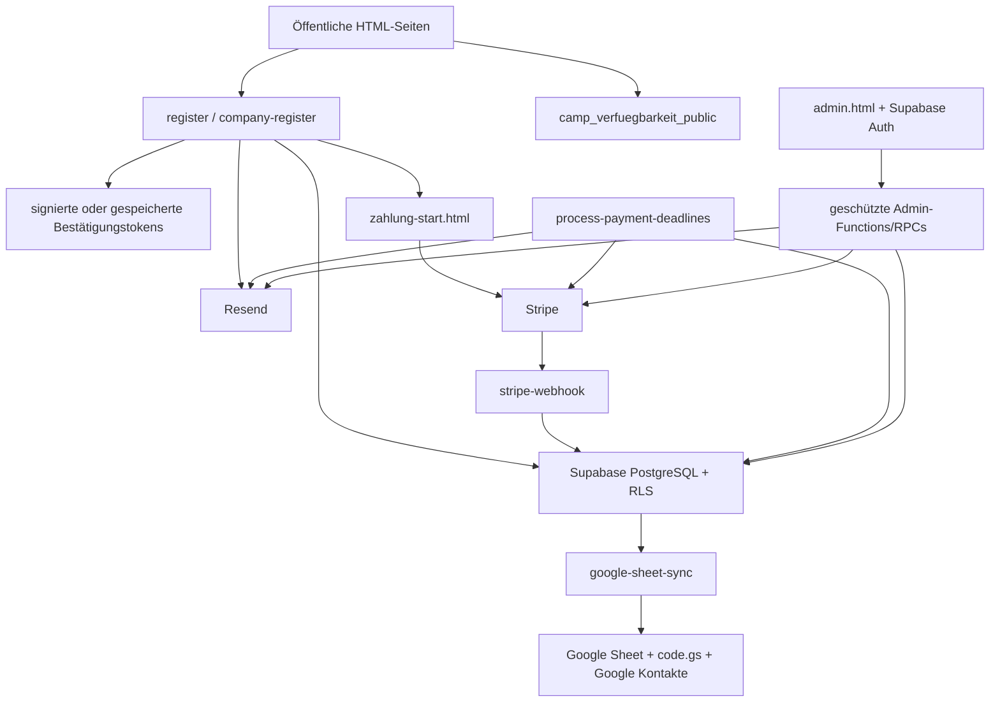

# Architektur

Stand: 18. Juli 2026
Dokumentationsstatus: bestätigt für den Repository-Stand
Geltungsbereich: Frontend, Backend, Datenflüsse und kritische Schnittstellen

## Gesamtbild

## Frontend

- **Bestätigt:** Jede Seite ist eine eigenständige HTML-Datei mit seitenbezogenem CSS und überwiegend eingebettetem JavaScript.
- **Bestätigt:** `index.html` ist Startseite, Campübersicht, FAQ, Bewertungen, Galerie und lokale Landingpage.
- **Bestätigt:** `anmeldung.html` ist die Eltern-/Sponsorstrecke; `firmen-anmeldung.html` die Firmen-/Mitarbeiterstrecke.
- **Bestätigt:** `bestaetigung.html` und `bestaetigung-firma.html` laden persönliche Daten nur über passende Tokenstrecken.
- **Bestätigt:** `zahlung-start.html` prüft die Stripe-Ziel-URL sowie den signierten aktuellen Buchungsstatus und blockiert bezahlte, stornierte oder abgelaufene Anmeldungen.
- **Bestätigt:** `admin.html` ist eine große eigenständige Betriebsoberfläche für Camps, Anmeldungen, Finanzen, Aktionen, Anwesenheit und Leistungswerte.
- **Bestätigt:** `teams.html`, `gutschein.html`, `demo-default.html`, `newsreader/654.html` und `camps-in/index.html` sind noindex-Redirect-Stubs, keine Inhaltsseiten.
- **Bestätigt:** `camps-in/ostercamp-I-2026.html` ist eine noindex-Galerieseite.

## Öffentliche Campdaten

- **Bestätigt:** Der Browser liest nur die reduzierte View `camp_verfuegbarkeit_public`.
- **Bestätigt:** Die View nutzt Besitzerrechte (`security_invoker=false`), weil sie aggregierte freie Plätze aus privaten Tabellen ableitet.
- **Bestätigt:** Direkte anonyme Zugriffe auf `anmeldungen`, `firmen_anmeldungen`, `confirmation_tokens` und `email_outbox` werden durch den Sicherheitstest negativ geprüft.
- **Risiko:** Die ähnliche interne Quelle `camp_verfuegbarkeit` wird serverseitig in Functions verwendet und darf nicht mit der öffentlichen View verwechselt werden.

## Eltern- und Sponsoranmeldung

1. `anmeldung.html` holt ein kurzlebiges Formulartoken von `register`.
2. Die Function prüft Nonce, Alter des Formulars, Honeypots, Inhalte sowie IP-/E-Mail-Rate-Limits.
3. Sponsorcodes werden optional mit Campbindung und persistentem Rate-Limit geprüft.
4. Die finale Registrierung validiert Camp, Verfügbarkeit, Duplikate und Finanzierungsart serverseitig.
5. Die Datenbanktrigger normalisieren Finanzfelder und schützen Camp/Kapazität/Duplikate.
6. Ein Bestätigungstoken wird erzeugt und die Mail über Resend versendet; bei Fehlern wird `email_outbox` genutzt.
7. Nur Elternzahlungen erhalten einen Stripe-Link mit eindeutiger Anmeldungsreferenz.

## Firmenanmeldung

1. `firmen-anmeldung.html` holt ein Token von `company-register`.
2. Die Function validiert, schreibt die kanonische Firmenanmeldung und erzeugt die gesicherte Bestätigung.
3. Firmenfälle sind nicht elternzahlungspflichtig und dürfen nicht in Elternumsatz oder Reminderselektion gelangen.

## Zahlung

- **Bestätigt:** `stripe-webhook` verifiziert die Stripe-Signatur und journalisiert Ereignisse in `stripe_webhook_events`.
- **Bestätigt:** Zuordnung erfolgt über eine valide Anmeldungs-UUID, passenden EUR-Betrag und Payment Intent; E-Mail-Fallback ist im aktuellen Webhook entfernt.
- **Bestätigt:** `sync_anmeldungen_payment_status()` schützt terminale Zustände wie storniert/erstattet vor unbeabsichtigtem Überschreiben.
- **Bestätigt:** Erstattungen laufen über `admin-payment-action`; die DB wird erst nach Stripe-Erfolg aktualisiert.
- **Bestätigt:** Historische Stripe-/PayPal-Backfills sind Dry-Run-first und kein Ersatz für den Live-Abgleich.
- **Bestätigt im Repository:** `process-payment-deadlines` gleicht fällige Kandidaten unmittelbar vor Mail/Freigabe nochmals anhand `client_reference_id`, EUR-Betrag, `payment_status` und Payment Intent mit Stripe ab. Bei API-Fehlern oder uneindeutigen Treffern bleibt der Datensatz unangetastet.
- **Bestätigt im Repository:** 72 Stunden nach Anmeldung folgt eine Letzterinnerung; erst mindestens 24 Stunden nach erfolgreichem Versand kann die Anmeldung automatisch storniert werden. Die produktive Aktivierung von Migration, Function, Secret und Zeitplan ist getrennt zu bestätigen.

## Admin

- **Bestätigt:** Authentifizierung erfolgt über Supabase Auth; Berechtigung zusätzlich über `dashboard_admins`/`is_dashboard_admin()`.
- **Bestätigt:** sensible Änderungen werden in `security_audit_log` journalisiert.
- **Bestätigt:** Löschen läuft transaktional über `dashboard_delete_registration`; fachlich ist Stornieren der Standard.
- **Bestätigt:** Anwesenheitswrites liegen zunächst in der gerätegebundenen `localStorage`-Queue `teilnahme_q` und werden nach Online/Login synchronisiert.
- **Risiko:** Eine Queue auf dem iPad ist vom Mac nicht sichtbar und kann unter Browser-/Geräteeingriff verloren gehen.

## E-Mail und Outbox

- **Bestätigt:** `register`, `company-register`, `send-reminder`, `send-google-review-request` und `send-missing-confirmations` nutzen Resend.
- **Bestätigt:** `email_outbox` hält fehlgeschlagene Transaktionsmails privat; `process-email-outbox` verarbeitet atomar und mit Idempotenz wieder.
- **Bestätigt:** Kampagnenläufe werden in `email_campaign_runs` gegen Mehrfachversand geschützt.
- **Bestätigt im Repository:** Zahlungsfrist-Mails besitzen eine anmeldungsbezogene Outbox-Eindeutigkeit. Eine fehlgeschlagene oder noch wartende Mail startet keine Freigabefrist; jeder Outbox-Retry gleicht Stripe erneut ab und wird bei späterem Zahlungseingang ungesendet beendet.
- **Bestätigt:** `send-ostercamp2-campaign` antwortet dauerhaft mit HTTP 410 und ist nicht zu reaktivieren.

## Deploymentgrenzen

- **Bestätigt:** `ci/deploy.sh` deployed eine Positivliste per `rsync --delete --delete-excluded`, legt vorher ein Remote-Backup an und hält drei Backups.
- **Bestätigt:** `supabase/`, `scripts/`, Markdown, Paketdateien, private Exporte und Secrets gehören nicht in den Webroot.
- **Bestätigt:** Git-Push, Website-Deployment, Migrationen, Function-Deploys, E-Mail-Versand und Social-Publishing sind getrennte Zustandsänderungen.
- **Risiko:** Die Allowlist umfasst aktuell fast ganz `images/`; dadurch können große Rohmedien, Videos und PSD-Dateien unterhalb dieses Ordners öffentlich deployt werden.

## Kritische Fehlerquellen

- private und öffentliche Camp-View verwechseln;
- Legacy-`zahlungsstatus` allein als Zahlungswahrheit verwenden;
- Sponsor/Firma als offene Elternzahlung behandeln;
- Event-, Preis- oder Verfügbarkeitsdaten nur im HTML ändern;
- Bestätigungs- oder Formulartokens umgehen;
- lokale Offline-Queue als serverseitig gesichert annehmen;
- externe Veröffentlichung aus einem Git-Push ableiten;
- gesamte Medienordner ungeprüft deployen.

## Verwandte Dokumente

- [`DATA-MODEL.md`](DATA-MODEL.md)
- [`INTEGRATIONS.md`](INTEGRATIONS.md)
- [`../SECURITY-IMPLEMENTATION.md`](../SECURITY-IMPLEMENTATION.md)
- [`DEPLOYMENT.md`](DEPLOYMENT.md)
